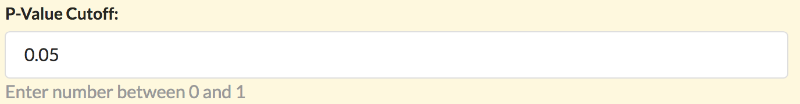

# Bioinformatics Recipes

## What is a bioinformatics recipe?

A recipe is a collection of commands with a graphical user interface.

It may be a bash script, an R script, a series of mothur instructions. Basically any list of commands that can be executed in an environment.

## What is a purpose of a recipe?

It allows reuse. It allows other people to run commands that you have written. When executed a recipe creates a full record of a data analysis run.

## Is recipe a single software tool?

Typically no. It is a series of actions that produce one full analysis.

## Is a recipe a pipeline a workflow engine?

No. Make, snakemake, and other workflow engines could be used inside a recipe.

## Is a recipe like a pipeline?

Yes. It may be thought of as a web enabled pipeline execution environment.

## Can command <...> be turned into a recipe?

Yes, if it can be invoked from the command line.

## Can I copy and modify a recipe?

Yes. One of the main design elements focus on modifying and sharing recipes.

## Does a copied recipe become mine?

Yes. Once you copy a recipe it becomes yours. Your version may diverge from the original one.

## If I modify a recipe will my previous results be altered?

No. A result has a snapshot of the recipe as it existed at the time the run was initiated.

## What is a recipe built from?

A recipe is built out of two files:

1. A graphical user interface (GUI) specification (aka the data)
2. The script itself as a template (aka the template).

## What is the GUI spec?

It is a file in JSON (Javascript Object Notation).

It represents a so called "dictionary" of data.

## What is the minimal GUI spec?

The minimal GUI spec for a tool

    {}

An empty dictionary. When we want to specify more information we add fields to this dictionary.

## What is the minimal script?

An empty file is a valid script.

## Will a recipe with "nothing" in it work?

Yes. The recipe will have a `RUN` button and can be executed. It will produce log files that capture information about the "empty" run. For an example view the output of the first recipe in the tutorial list:

https://www.bioinformatics.recipes/recipe/list/tutorial/

## How do I specify a name for the recipe?

Add a field into the GUI spec:

    {
        settings: {
            name: Hello World!
        }
    }

## How do I specify a parameter for the recipe?

Add the parameter as a key to the recipe:

    {
        cutoff: {
            label: P-Value Cutoff
            display: FLOAT
            value: 0.05
            range: [ 0, 1]
        }

        settings: {
            name: Hello World!
        }
    }

This will generate an interface element called

## How do I use a parameter in the script template?

If you have a parameter called `cutoff` as above you can use it in a recipe as

    {{ cutoff.value }}

The placeholder `{{ cutoff.value }}` will get substituted with the user selection in your script. If your script is in bash you could write:

    echo "You selected a cutoff of: {{ cutoff.value }}"

## How do I learn more about interfaces?

Visit the `Tutorial Project` and the `Biostar Cookbook` for examples of building interface elements and using them in scripts.

## What is  project?

A project is a collection of data, recipes and results.

