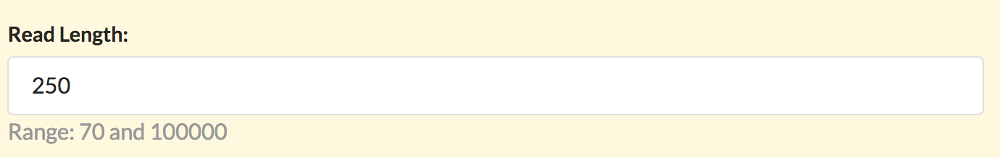

## Tutorial

A recipe consists of two files: 

1. The interface specification. This is a text file in the JSON format that describes the parameters
and how these are rendered.
2. The script template. This specify the actions that the script performs.

## First example

Our simplest recipe is

* `hello1.hjson` is the inteface JSON file
* `hello1.sh` is the script template for the first recipe

The interface file `hello1.hjson` contains the bare minimum information
needed to provide a simple context for the tool. This recipe does not take
any external parameters. 

    
    {
      settings: {
        name: Hello World
        summary: This recipe prints: Hello World!
        help:
          '''
          # Help
        
          This recipe prints **Hello World!** to the console.
        
          Note how the console output is captured in the standard output of the results.
          '''
      }
    }

Whereas the `hello1.sh` contains:
    
    # This is a regular bash script.
    
    echo 'Hello World!'

For the JSON file the site also allows the human friendly version of JSON called HJSON (http://hjson.org)
but "proper" JSON may be used as well.

## How are parameters handled?

The example above could be extended with:

    {

      readlen: {
        label: Read Length
        display: INTEGER
        value: 250
        range: [ 70, 100000 ]
      }

      settings: {
        name: Hello World
        summary: This recipe prints: Hello World!
        help:
          '''
          # Help
        
          This recipe prints **Hello World!** to the console.
        
          Note how the console output is captured in the standard output of the results.
          '''
      }
    }

Whereas the script template could be extended to read:
    
    echo "The readlenght is {{readlen.value}}"

When a recipe is run the site generates a user interface for the
parameter called `readlen` that will look like this:

When executed the value from the interface above will be filled into
the script to produce

    echo "The readlenght is 250"
